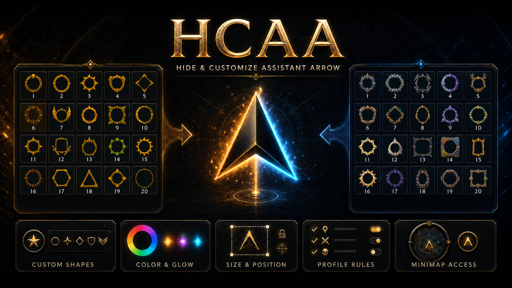

<p align="center">
  
</p>

# HCAA v1.4.1 Official

## Hide & Customize Assistant Arrow

HCAA is a lightweight World of Warcraft addon that lets you completely hide or fully customize Blizzard's Single-Button Assistant Arrow while remaining fast, lightweight, and fully compatible with modern UI replacements.

---

## ✨ Features

- Hide the Assistant Arrow completely
- 20 built-in custom frame styles
- Custom frame colors
- Optional glow effects
- Opacity, scale, rotation, and X/Y position controls
- Live preview
- Draggable minimap button
- Account, character, and specialization profiles
- Combat and zone visibility rules
- Import & Export settings
- Lightweight, event-driven detection

---

## 🖥️ Supported Interfaces

- ✅ Blizzard Default UI
- ✅ ElvUI
- ✅ EllesmereUI

HCAA automatically detects the active interface and applies the correct behavior.

---

## 🎨 Included Frame Styles

- Skull Ring
- Circle
- Star
- Shield
- Diamond
- Rune
- Wings
- Flame
- Lightning
- Moon
- Compass
- Sword
- Crown
- Crystal
- Sun
- Void
- Hexagon
- Triangle
- Cross
- Minimal Ring

---

## 🖱️ Minimap Controls

| Action | Function |
|--------|----------|
| Left Click | Open Options |
| Right Click | Enable / Disable HCAA |
| Middle Click | Hide / Show Arrow |
| Mouse Wheel | Change Opacity |
| Drag | Move Button |

---

## 💬 Slash Commands

```text
/hcaa
/hcaa on
/hcaa off
/hcaa toggle
/hcaa opacity 0-100
/hcaa reset
```

---

## ✅ Compatibility

- World of Warcraft: The War Within
- Blizzard Default UI
- ElvUI
- EllesmereUI

---

## 📜 License

MIT License

---

## 👤 Author

**FaneyQ8**

**GitHub**  
https://github.com/faneyq8

**Twitch**  
https://www.twitch.tv/gamerzoneq8

**TikTok**  
https://www.tiktok.com/@gamerzoneq8
